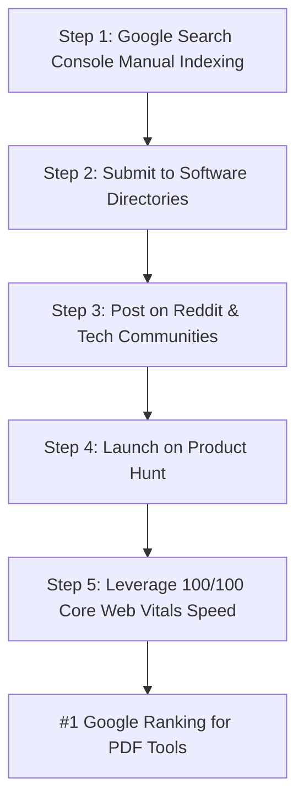

# 🚀 e-pdf.online — Complete Deployment, Google AdSense & SEO Ranking Guide

This document outlines the complete technical setup, monetization architecture, and App-First SEO strategy to rank **[https://e-pdf.online](https://e-pdf.online)** at the top of Google search results.

---

## 📌 Executive Overview & Technical Advantage

* **Domain:** `https://e-pdf.online` (Redirects `www.e-pdf.online` $\rightarrow$ `e-pdf.online`)
* **Tech Stack:** Next.js 16 (App Router), TypeScript, Tailwind CSS v4, WebAssembly (`pdf-lib`, `pdfjs-dist`, `docx`, `mammoth`).
* **Hosting:** Vercel Global Edge Network (Hobby Free Tier — **$0/month**).
* **Architecture:** **100% Client-Side Processing.** Files never touch a remote server. 
* **Profit Margin:** **100% Pure Profit.** Zero server bandwidth fees regardless of traffic spikes.

---

## 💰 1. Google AdSense Monetization Setup

### Verified Credentials
* **Publisher ID:** `ca-pub-1776155901449529`
* **Google Account Verification Meta Tag:** `<meta name="google-adsense-account" content="ca-pub-1776155901449529" />`

### Key Files Configured for AdSense:
1. **[`public/ads.txt`](file:///d:/e-projects/e-pdf/public/ads.txt)**
   ```text
   google.com, pub-1776155901449529, DIRECT, f08c47fec0942fa0
   ```
2. **[`app/layout.tsx`](file:///d:/e-projects/e-pdf/app/layout.tsx)**
   * Dynamically injects `adsbygoogle.js` script tag in `<head>`.
   * Renders the GDPR/CCPA [`CookieConsent`](file:///d:/e-projects/e-pdf/components/CookieConsent.tsx) banner for EU/UK/California policy compliance.
3. **[`components/AdBanner.tsx`](file:///d:/e-projects/e-pdf/components/AdBanner.tsx)**
   * Pre-styled responsive ad containers (`horizontal` leaderboards & `rectangle` banners).
4. **Vercel Environment Variables:**
   * `NEXT_PUBLIC_SITE_URL` = `https://e-pdf.online`
   * `NEXT_PUBLIC_ADSENSE_PUBLISHER_ID` = `ca-pub-1776155901449529`

---

## 🌐 2. Domain & DNS Configuration (Namecheap $\rightarrow$ Vercel)

### Namecheap Advanced DNS Host Records:
* **A Record:** `@` $\rightarrow$ `76.76.21.21` (TTL: Automatic)
* **CNAME Record:** `www` $\rightarrow$ `cname.vercel-dns.com` (TTL: Automatic)

### Vercel Routing:
* `e-pdf.online` $\rightarrow$ Connected to **Production Environment**
* `www.e-pdf.online` $\rightarrow$ Redirects to **`e-pdf.online`**

---

## 🏆 3. App-First SEO Strategy: How to Rank #1 on Google (No Blog Required)



### Step 1: Force Google Indexing for All 8 Tool URLs
Submit all 8 core tool pages in [Google Search Console](https://search.google.com/search-console) using the top **URL Inspection** search bar:
1. `https://e-pdf.online/merge-pdf`
2. `https://e-pdf.online/compress-pdf`
3. `https://e-pdf.online/split-pdf`
4. `https://e-pdf.online/images-to-pdf`
5. `https://e-pdf.online/pdf-to-word`
6. `https://e-pdf.online/word-to-pdf`
7. `https://e-pdf.online/rotate-pdf`
8. `https://e-pdf.online/watermark-pdf`

*Action:* Click **"REQUEST INDEXING"** for each tool URL.

---

### Step 2: Build High-Authority Direct Tool Backlinks
Increase Domain Authority (DA) by listing `e-pdf.online` on top software aggregator platforms:
* **[AlternativeTo.net](https://alternativeto.net):** List as a free web app alternative to *Smallpdf*, *iLovePDF*, and *Adobe Acrobat*.
* **[Toolify.ai](https://toolify.ai):** Submit under *"Free Online Utility Apps"*.
* **[SaaSHub](https://saashub.com):** Create a free tool profile for `e-pdf.online`.
* **[Slant.co](https://slant.co):** Recommend `e-pdf.online` for *"Best free browser-based PDF merger"*.

---

### Step 3: Promote on Reddit & Tech Communities
Drive initial high-intent user traffic to trigger Google ranking algorithms:
* **Target Subreddits:** `r/software`, `r/usefulwebsites`, `r/tools`, `r/webdev`.
* **Suggested Title:**
  > *"I built e-pdf.online — a 100% free web app to merge, compress & convert PDFs inside your browser with zero file uploads or data collection."*

---

### Step 4: Product Hunt Launch
Create a free product launch on [Product Hunt](https://www.producthunt.com):
* **Product Name:** `e-pdf.online`
* **Tagline:** *"Free, 100% browser-based PDF tools with zero file uploads."*
* **Link:** `https://e-pdf.online`

---

### Step 5: Leverage Core Web Vitals & Schema.org Advantages
* **Built-in Schema.org JSON-LD:** Every tool page includes `SoftwareApplication`, `HowTo`, and `FAQPage` structured data to display rich app cards in search results.
* **Instant Client-Side Speed (< 0.3s):** Google heavily prioritizes fast-loading interactive web utilities over slow competitor sites.

---

## ✍️ 4. Optional Built-In Content CMS (For Long-Tail Articles)

If you ever wish to publish articles or long-tail PDF guides:
* Articles are located in [`content/blog/`](file:///d:/e-projects/e-pdf/content/blog).
* Create any `.md` markdown file in [`content/blog/your-guide.md`](file:///d:/e-projects/e-pdf/content/blog).
* Dynamic rendering is handled via [`app/blog/[slug]/page.tsx`](file:///d:/e-projects/e-pdf/app/blog/%5Bslug%5D/page.tsx) and auto-indexed in [`sitemap.xml`](file:///d:/e-projects/e-pdf/app/sitemap.ts).

---

## 🛠️ Developer Commands Quick Reference

```bash
# Start local dev server
pnpm dev

# Test static production build
pnpm build

# Deploy updates to Vercel via GitHub
git add .
git commit -m "Your update message"
git push origin main
```
